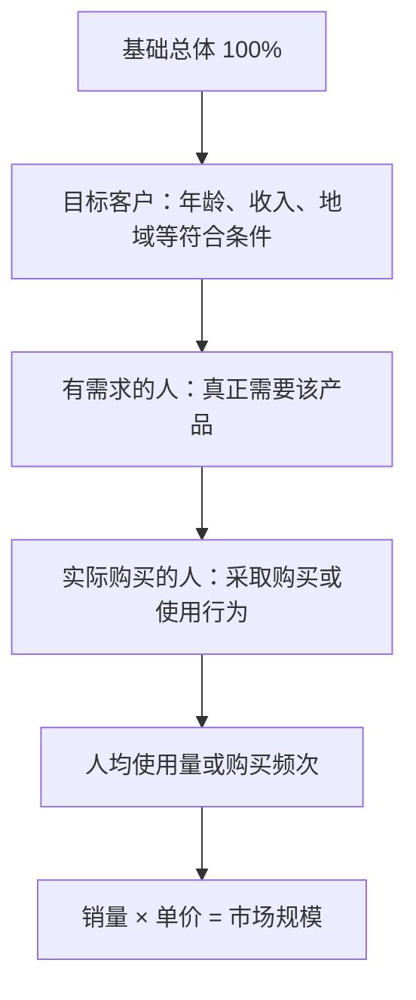
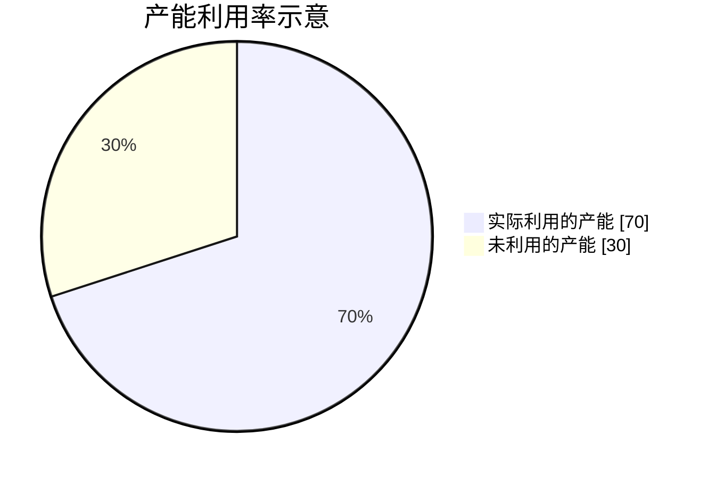
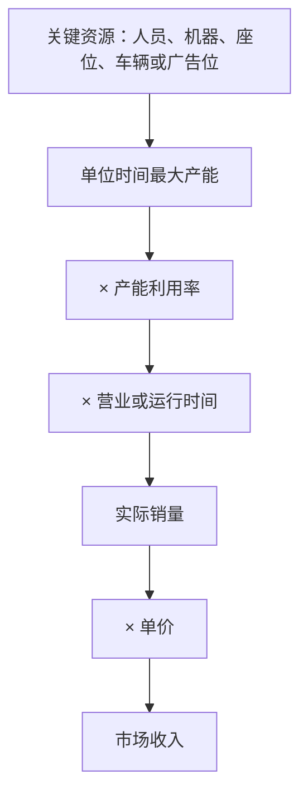
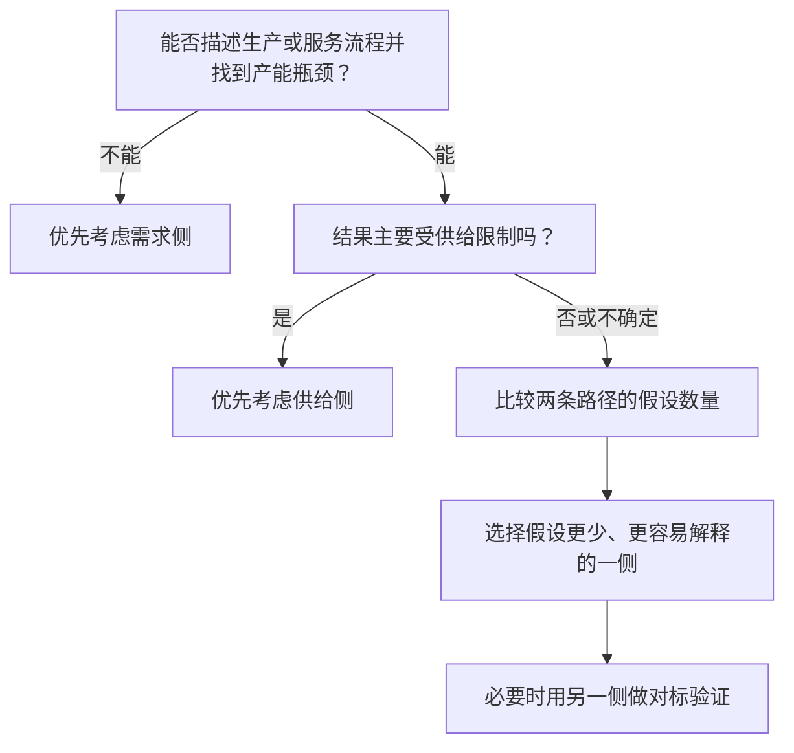
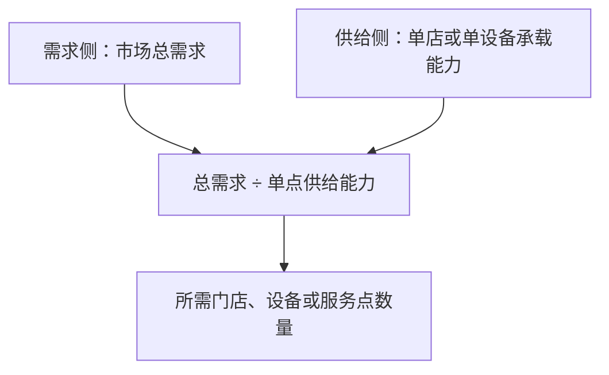

# Market Sizing 可视化模板

## 目录

1. 使用规则
2. 需求侧基础漏斗
3. 供给侧产能容量图
4. 供给侧公式树
5. 算法选择图
6. 混合算法图

## 使用规则

- 零基础教学第一次介绍算法时，同时展示需求侧漏斗和供给侧产能图。
- 进入例题后，把模板中的通用文字替换成题目变量和实际数字。
- 需求侧优先展示“总体如何逐层缩小”；供给侧优先展示“最大产能中实际利用了多少”。
- Mermaid 不支持或渲染不稳定时，使用同节提供的文本版本。
- 图只承担一个核心关系，不把全部计算塞进一张图。

## 需求侧基础漏斗



同时显示完整公式：

```text
购买人数 = 基础总体 × 目标客户占比 × 需求率 × 购买率
销量 = 购买人数 × 人均使用量或购买频次
市场规模 = 销量 × 单价
```

文本兜底：

```text
基础总体 100%
    ↓ 筛选目标客户
目标客户
    ↓ 筛选真正有需求的人
有需求的人
    ↓ 筛选真正购买的人
购买人数
    ↓ 乘人均使用量或频次
销量
    ↓ 乘单价
市场规模
```

## 供给侧产能容量图

用整个圆圈表示最大产能，用圆圈中的已利用部分表示实际产量：



概念解释：

```text
最大产能 = 100% 的理论上限
实际产量 = 最大产能 × 产能利用率
闲置产能 = 最大产能 − 实际产量
```

文本容量条兜底：

```text
最大产能  |████████████████████| 100%
实际产量  |██████████████------|  70%
闲置产能  |--------------██████|  30%
```

基础教学可使用 70% 的示意数字。进入具体题目后，必须换成题目计算出的实际利用率；若没有可靠利用率，只展示概念关系，不伪造比例。

## 供给侧公式树



同时显示完整公式：

```text
单位时间最大产能 = 关键资源数量 × 每个资源的单位时间产能
实际销量 = 单位时间最大产能 × 产能利用率 × 时间
市场收入 = 实际销量 × 单价
```

## 算法选择图



## 混合算法图



典型公式：

```text
门店数量 = 市场总需求 ÷ 单店可承载需求
```
